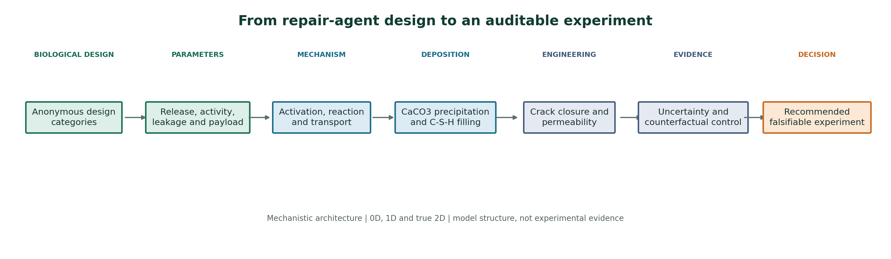

<div align="center">
  
  <h1>BioConcrete Multiscale Model</h1>
  <p><strong>A multiscale reaction-transport model connecting repair-agent activation to mineral deposition, crack closure, and experiment design.</strong></p>
  <p>
    <a href="https://github.com/Zwhua/bioconcrete-multiscale-model/releases/tag/v0.5.1"></a>
    <a href="https://github.com/Zwhua/bioconcrete-multiscale-model/actions/workflows/tests.yml"></a>
    <a href="https://github.com/Zwhua/bioconcrete-multiscale-model/actions/workflows/tests.yml"></a>
    <a href="https://www.python.org/downloads/"></a>
    <a href="LICENSE"></a>
  </p>
  <p>English | <a href="README.zh-CN.md">简体中文</a></p>
  <p>
    <a href="#key-results"><strong>Results</strong></a> ·
    <a href="#evidence-status"><strong>Evidence</strong></a> ·
    <a href="#quick-start"><strong>Quick Start</strong></a> ·
    <a href="MODELING.md"><strong>Technical Model</strong></a>
  </p>
</div>

> [!IMPORTANT]
> **Evidence status:** uncalibrated mechanistic model; team wet-lab time-series data = **0 rows**. All numerical results below are model outputs, not experimental observations.

<table align="center">
  <tr>
    <td align="center"><strong>2.0819%</strong><br><sub>28-day crack closure</sub></td>
    <td align="center"><strong>99.92%</strong><br><sub>of closure from C-S-H prior</sub></td>
    <td align="center"><strong>0 rows</strong><br><sub>team wet-lab time series</sub></td>
  </tr>
</table>

## At a Glance

| | Summary |
| --- | --- |
| **Problem** | Predict how release, reaction, transport, CaCO3 precipitation, and C-S-H filling interact inside a self-repairing concrete crack. |
| **Model** | Coupled 0D kinetics, 1D finite-volume transport, and a true 2D reaction-transport solver with explicit inventory and geometry accounting. |
| **Key finding** | The default uncalibrated baseline reaches **2.0819%** closure at 28 days; about **99.92%** of that closure comes from the assumed C-S-H payload. |
| **Next experiment** | Compare the complete system, a no-C-S-H condition, and an abiotic C-S-H control before prioritizing higher aggregate activity. |

These are **prospective model conclusions**. They have not been confirmed by team experiments or public-data calibration.

> [!TIP]
> **Model-informed decision:** prioritize the complete system, no-C-S-H condition, and abiotic C-S-H control. Higher aggregate activity is currently a lower-priority experiment because the baseline is dominated by inventory and geometry rather than activity.

## Why This Model Matters

The model connects aggregate biological design parameters to material-scale performance without claiming to resolve a particular construct. It separates CaCO3 deposition from nonbiological C-S-H filling, tracks carbon, calcium, and complete repair-agent inventories, and converts deposited wall volume into a geometrically defined crack-closure ratio.

Sensitivity, practical identifiability, counterfactual bottleneck analysis, and numerical D-optimal design are implemented to decide what should be measured next. Negative findings are retained: under the current priors, increasing aggregate activity alone is unlikely to improve closure materially unless inventory, transport, deposition, or geometry constraints also change.

## Model to Decision

<p align="center">
  
</p>

<p align="center"><sub><em>Architecture schematic, not an experimental result. Anonymous design categories are mapped to measurable parameters, multiscale material response, and falsifiable experiments.</em></sub></p>

## Key Results

| Result | Current model output | Interpretation |
| --- | ---: | --- |
| 28-day crack closure | **2.0819%** | Uncalibrated baseline |
| C-S-H contribution | **2.08023 percentage points** | Dominant prior contribution |
| Calcite contribution | **0.00168 percentage points** | Minor under current priors |
| Relative transmissivity | **0.9388** | Cubic-law model output |
| Team wet-lab rows | **0** | Not experimentally validated |

> [!NOTE]
> **Main conclusion:** the current prior configuration is not primarily activity-limited. Increasing aggregate activity alone is unlikely to produce a material closure improvement unless inventory, transport, deposition, or geometry constraints are changed. The approximately 2.08% result is not a performance claim and the 80% target is not hard-coded.

## Evidence Status

| Evidence component | Status | Claim allowed |
| --- | --- | --- |
| Numerical conservation | Complete | Numerically verified |
| Physical-limit and reproducibility tests | Complete | Numerically verified |
| Uncalibrated 0D baseline | Complete | Model output only |
| Formal 1024-sample Sobol analysis | Pending | Interface only; no result claim |
| Full 1,728-scenario matrix | Pending | Preregistered; no result claim |
| Public-data calibration | Data pending | No calibrated claim |
| Independent external evaluation | Data pending | No validation claim |
| Team wet-lab time series | 0 rows | No experimental claim |

The committed V5 release manifest is an **initialization record**, not a completed formal run: it records commit `4266ef9`, `git_worktree_dirty: true`, and `status: initialized`. A clean-commit formal manifest remains pending; the repository does not rewrite this provenance to make the release appear complete.

## Quick Start

```bash
git clone https://github.com/Zwhua/bioconcrete-multiscale-model.git
cd bioconcrete-multiscale-model
python -m pip install -r requirements-lock.txt
python -m pip install -e . --no-build-isolation

python -m bioconcrete default-config --output config-v0.5.1.json
python -m bioconcrete simulate --level 0d --config config-v0.5.1.json
python -m bioconcrete validate --config config-v0.5.1.json
```

See [MODELING.md](MODELING.md) for equations and advanced workflows, [data/public/README.md](data/public/README.md) for public-data curation, and [WIKI_MODEL.md](WIKI_MODEL.md) for the iGEM-oriented model narrative.

## Capabilities

| Capability | Implementation | Output |
| --- | --- | --- |
| 0D kinetics | BDF reaction solver | Time courses and balances |
| 1D transport | Implicit finite-volume model | Axial profiles |
| 2D transport | True length-width solver | Spatial maps |
| Chemistry | Dynamic charge balance; analytical geochemical surrogate | pH and carbonate state |
| Uncertainty | Resumable prior-predictive workflow | Prior intervals |
| Design | Counterfactual and numerical D-optimal interfaces | Prospective decision tables |
| Reproducibility | Seeds, hashes, frozen configurations, manifests | Auditable runs |

The quick validation currently passes carbon and calcium conservation, nonnegativity, no-source controls, time-step convergence, and 1D/2D grid convergence. The full local suite contains **82 passing tests**. Numerical verification does not establish experimental validity.

## Biological Design Connection

| Design category | Model parameter | Required measurement |
| --- | --- | --- |
| Surface localization | Effective surface retention / active-unit concentration | Surface-associated retained activity |
| Linker accessibility | Activity multiplier | Matched relative activity |
| Candidate enzyme activity | Effective kinetic prior | Aggregate kinetics and stability |
| Microcapsule | Release rate and basal leakage | Release and pre-crack loss curves |
| C-S-H payload | Initial nonbiological fill | Abiotic C-S-H control |

These are parameter mappings, not measured performances of specific biological implementations. The repository stores no sequence, mutation, vector, or construction protocol in this interface.

## Repository Structure

```text
bioconcrete/       Core model and analysis package
data/              Priors, schemas, and public-data manifests
model_runs/        Versioned analysis artifacts
tests/             Numerical and evidence-boundary tests
MODELING.md        Technical model documentation
WIKI_MODEL.md      iGEM-oriented narrative
```

## Limitations and Roadmap

1. **Public calibration data are not yet curated.** Kinetic and material-response parameters cannot be claimed as calibrated.
2. **Independent external evaluation is incomplete.** No experimental MAE, RMSE, R2, AIC/AICc, or coverage result is reported.
3. **Team wet-lab time-series data are unavailable.** Prospective recommendations remain falsifiable plans, not a completed DBTL loop.
4. **PHREEQC cross-checking is pending.** Current chemistry uses an `analytical_surrogate`, so no PHREEQC-coupling claim is made.
5. **Formal long analyses are pending.** The 1024-base-sample Sobol run, full 1,728-scenario matrix, and figures 2-8 are intentionally absent.
6. **Crack geometry is simplified.** Results do not resolve full 3D roughness, structural mechanics, or field-scale safety.

## Citation and License

Current release: [v0.5.1](https://github.com/Zwhua/bioconcrete-multiscale-model/releases/tag/v0.5.1). Cite the software using [CITATION.cff](CITATION.cff); no paper or DOI is claimed. The project is distributed under the [MIT License](LICENSE).
