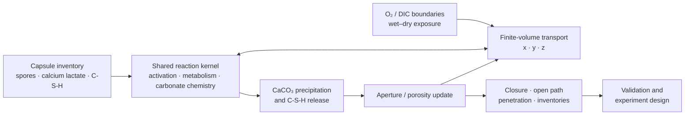
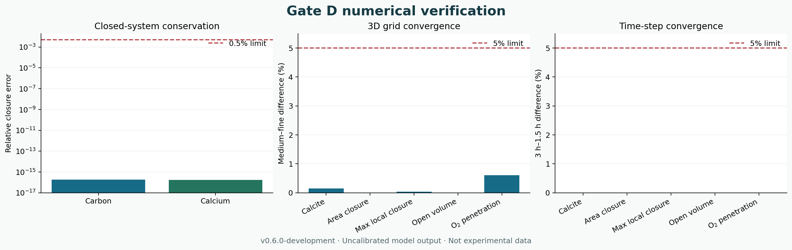
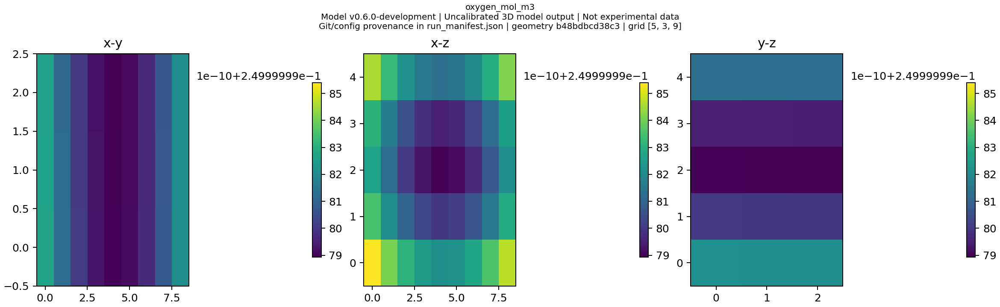
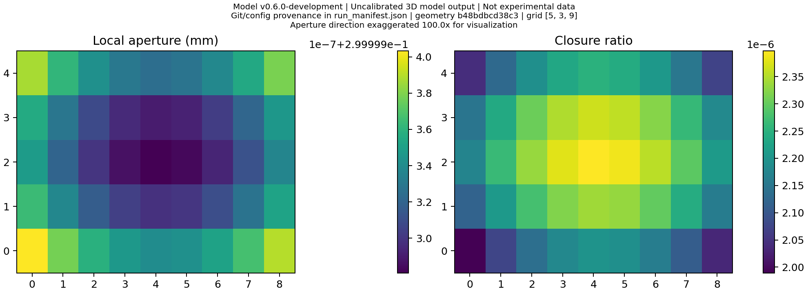

<div align="center">
  
  <h1>BioConcrete Multiscale Model</h1>
  <p><strong>Conservative multiscale reaction–transport simulation for microbially assisted crack repair.</strong></p>
  <p>
    <a href="https://github.com/Zwhua/bioconcrete-multiscale-model/releases/tag/v0.5.1"></a>
    
    <a href="https://github.com/Zwhua/bioconcrete-multiscale-model/actions/workflows/tests.yml"></a>
    <a href="https://www.python.org/downloads/"></a>
    <a href="LICENSE"></a>
  </p>
  <p>English · <a href="README.zh-CN.md">简体中文</a></p>
  <p>
    <a href="#engineering-objective"><strong>Objective</strong></a> ·
    <a href="#solution"><strong>Method</strong></a> ·
    <a href="#data-and-evidence"><strong>Data</strong></a> ·
    <a href="#numerical-experiments-and-results"><strong>Results</strong></a> ·
    <a href="#reproduce-the-results"><strong>Reproduce</strong></a>
  </p>
</div>

> [!IMPORTANT]
> **Evidence boundary:** this repository contains an **uncalibrated mechanistic model**. Team wet-lab time-series data = **0 rows**. “Experiments” below means numerical verification or computational experiments—not laboratory observations, structural-strength predictions, or field validation.

<table align="center">
  <tr>
    <td align="center"><strong>Gate D passed</strong><br><sub>conservation · reduction · convergence</sub></td>
    <td align="center"><strong>&lt; 1.9 × 10<sup>−16</sup></strong><br><sub>closed-system C/Ca balance error</sub></td>
    <td align="center"><strong>0.606%</strong><br><sub>largest medium–fine difference</sub></td>
    <td align="center"><strong>128 passed</strong><br><sub>local Python 3.8 test run</sub></td>
  </tr>
</table>

## Engineering Objective

Self-healing concrete spans several coupled scales: repair-agent release and microbial metabolism change aqueous chemistry; transport redistributes oxygen, lactate, inorganic carbon, and calcium; CaCO₃ precipitation and C-S-H filling reduce local aperture; the evolving geometry then feeds back into transport.

The engineering goal is to make this chain **mass-conservative, spatially explicit, restartable, and falsifiable**. The model is designed to answer questions such as:

- where oxygen or substrate limitation suppresses repair inside a crack;
- whether surface closure hides an internally connected open pathway;
- how much closure comes from CaCO₃ versus the assumed C-S-H payload;
- which measurements or controls would most reduce decision uncertainty.

It is a reaction–transport and aperture-evolution model, not a complete concrete mechanics or strength-recovery model.

## Solution



The implementation uses a shared 0D reaction kernel and implicit, cell-centred finite-volume transport. The 3D solver uses **Strang splitting**—half transport, full reaction, half transport—with steps cut exactly at output, wet/dry transition, and checkpoint times. Deposited solids update aperture, fluid fraction, porosity, and sealed columns before the next transport solve.

Key engineering features include:

- explicit 0D, 1D, legacy `(x,y)` 2D, `(x,z)` 2.5D adapter, and full `(x,y,z)` 3D paths;
- mutually exclusive Robin boundary oxygen supply and legacy volumetric oxygen supply;
- volume-weighted carbon/calcium ledgers, per-species face fluxes, and reaction integrals;
- bounded time-step retry with a machine-readable failure manifest;
- resumable checkpoints carrying state, ledger, counters, configuration hash, and geometry hash;
- formal Xarray/Zarr fields with canonical `(time,z,y,x)` ordering and evidence metadata;
- headless Matplotlib PNG/SVG output and optional PyVista isosurfaces/HTML.

See [MODELING.md](MODELING.md) for the established equations and [THREED_MODEL_SPEC.md](THREED_MODEL_SPEC.md) for the frozen 3D development specification.

## Data and Evidence

The repository deliberately separates **input priors**, **public-data manifests**, **synthetic verification scenarios**, and **experimental observations**.

| Data layer | Repository location | Contents | Evidence use |
| --- | --- | --- | --- |
| Public dataset registry | [`data/public/DATASETS.yml`](data/public/DATASETS.yml) | Four accession-level records for calibration, external evaluation, and measurement error; raw files are not redistributed | Acquisition plan; no calibration claim |
| Aggregate kinetic priors | [`data/processed/model_priors/`](data/processed/model_priors/) | 38 SABIO-RK summary rows, 10 BRENDA summary rows, 10 registered parameters | Prior construction only |
| Carbonate lookup | [`data/processed/geochem/`](data/processed/geochem/) | Analytical-surrogate carbonate states and metadata | Fast chemistry lookup; not PHREEQC validation |
| Biological design map | [`data/biological_design/`](data/biological_design/) | Anonymous design categories mapped to measurable aggregate parameters | Prospective design interface |
| Gate D scenario | generated by `validate-3d --full` | One-day, continuous-wet, closed-boundary numerical case with explicit O₂/DIC, fixed seed, and equal total capsule inventory | Numerical verification only |
| Team wet-lab series | not available | **0 rows** | No experimental performance claim |

Protein sequences, mutation sites, genetic constructs, and strain-specific records are outside this model interface. Public-data licensing and download notes are documented in [data/public/README.md](data/public/README.md).

## Numerical Experiments and Results

### 1. Gate D verification

The frozen nonzero-reaction case passed every Gate D requirement: conservation, dimensional reduction, finite/nonnegative state, checkpoint equivalence, and grid/time convergence.

<p align="center">
  
</p>
<p align="center"><sub><em>Generated from the machine-readable full validation report. Dashed lines are preregistered acceptance limits. Uncalibrated model output; not experimental data.</em></sub></p>

| Check | Result | Acceptance | Status |
| --- | ---: | ---: | :---: |
| Closed-system carbon balance | **1.882 × 10⁻¹⁶** relative error | &lt; 0.5% | Pass |
| Closed-system calcium balance | **1.738 × 10⁻¹⁶** relative error | &lt; 0.5% | Pass |
| Single voxel 3D → shared 0D | **0** relative error | &lt; 1% | Pass |
| `y,z`-uniform 3D → 1D transport | **8.882 × 10⁻¹⁶** absolute error | ≤ 10⁻⁶ | Pass |
| `z`-uniform 3D → legacy `(x,y)` 2D | **1.243 × 10⁻¹⁴** absolute error | ≤ 10⁻⁶ | Pass |
| `y`-uniform 3D → `(x,z)` 2.5D | **1.421 × 10⁻¹⁴** absolute error | ≤ 10⁻⁶ | Pass |
| Largest medium–fine grid difference | **0.606%** (O₂ penetration depth) | &lt; 5% | Pass |
| Largest 3 h–1.5 h time-step difference | **0.00283%** (calcite amount) | &lt; 5% | Pass |

The grid study refines all directions together: **21×3×9 → 41×5×17 → 81×7×33**. Medium–fine differences were 0.153% for total calcite, 0.00146% for area-weighted closure, 0.0400% for maximum local closure, 3.27×10⁻⁷% for open volume, and 0.606% for oxygen penetration depth. The time study used 6 h, 3 h, and 1.5 h steps. These values demonstrate numerical consistency for the registered scenario; they do not establish parameter accuracy.

### 2. Spatial output and geometry feedback

<table>
  <tr>
    <td width="50%"></td>
    <td width="50%"></td>
  </tr>
  <tr>
    <td><sub><strong>Three-plane oxygen field.</strong> Canonical 3D state is stored as <code>(time,z,y,x)</code>; the renderer exposes matched <code>xy/xz/yz</code> slices.</sub></td>
    <td><sub><strong>Geometry feedback.</strong> Local solid deposition changes aperture and closure before subsequent transport. Aperture is exaggerated 100× only for visualization.</sub></td>
  </tr>
</table>

These panels come from a small **9×3×5 storage/render smoke run**. Its short 0.01-day duration is intended to test the artifact pipeline, not to estimate repair performance. Every formal figure carries the runtime version, configuration/geometry provenance, grid, and the labels “Uncalibrated 3D model output” and “Not experimental data.”

### 3. Existing 28-day baseline decision result

The established v0.5.1 default 0D baseline remains unchanged:

| Output | Model result | Interpretation |
| --- | ---: | --- |
| Crack closure at 28 days | **2.0819%** | Uncalibrated baseline; not a performance claim |
| C-S-H contribution | **2.08023 percentage points** | **99.92%** of modeled closure under the assumed payload |
| Calcite contribution | **0.00168 percentage points** | Minor under the current priors |
| Relative transmissivity | **0.9388** | Cubic-law model output |

This negative result is useful: under the current priors, simply increasing aggregate biological activity is unlikely to change closure materially unless inventory, transport, deposition, or geometry constraints change. The next recommended comparison remains the complete system, a no-C-S-H condition, and an abiotic C-S-H control.

## Development Gates

| Gate | Scope | Status |
| --- | --- | :---: |
| A | Frozen 3D scientific specification | ✅ Complete |
| B | Shared state/reaction schema and v0.5.1 regression | ✅ Complete |
| C | Conservative 3D transport, real z-gradient, flux closure, diffusion MMS | ✅ Complete |
| D | Coupled conservation, reduction, restart, grid/time convergence | ✅ Passed |
| E | Complete 2.5D reactive-transport applicability study | ⏳ Incomplete |
| F | Clean release-candidate CI, manifest, version bump, tag/release | ⏳ Incomplete |

For that reason, the installable package version remains **0.5.1** and 3D artifacts identify themselves as **v0.6.0-development**. Gate D passing authorizes formal 3D storage/rendering; it does not make v0.6.0 release-ready.

## Reproduce the Results

### Stable core and quick checks

```bash
git clone https://github.com/Zwhua/bioconcrete-multiscale-model.git
cd bioconcrete-multiscale-model
python -m pip install -r requirements-lock.txt
python -m pip install -e . --no-build-isolation

python -m bioconcrete default-config --output config-v0.5.1.json
python -m bioconcrete validate --config config-v0.5.1.json
python -m bioconcrete validate-3d --output model_runs/v0.6.0/validation_3d
```

### Full Gate D, Zarr, and formal figures

```bash
python -m pip install -e ".[three-d,visualization-3d]" --no-build-isolation
python -m bioconcrete validate-3d --config config-v0.5.1.json --output model_runs/v0.6.0/validation_3d --full
python -m bioconcrete simulate --level 3d --config config-v0.5.1.json --output model_runs/v0.6.0/3d/demo
python -m bioconcrete render-3d --run model_runs/v0.6.0/3d/demo
```

The full 3D validation is intentionally more expensive than the smoke check. Formal storage fails with a clear installation message when Xarray/Zarr/Numcodecs are absent; it never substitutes NPZ or CSV for a formal field artifact. PyVista is optional and affects only isosurface/interactive products.

Formal run layout:

```text
model_runs/v0.6.0/3d/<run_id>/
├── fields.zarr/              # full fields; (time,z,y,x)
├── summary.json              # scalar engineering metrics
├── diagnostics.json          # conservation and solver diagnostics
├── config.json               # resolved configuration
├── geometry.json             # dimensions and geometry hash
├── boundary_conditions.json
├── run_manifest.json         # Git/config/geometry provenance
├── performance.json
├── checkpoints/
└── figures/                  # evidence-labelled PNG/SVG/HTML
```

## Quality, Scope, and Limitations

- The local reference run completed **128 tests** on Python 3.8; one optional Zarr integration test was skipped there because that interpreter lacked the extra dependencies. Zarr round-trip integration passed separately on Python 3.12 with the extras installed.
- Historical v0.5.1 0D/1D/2D regression fixtures are frozen. The 3D implementation adds new paths without silently replacing legacy discretizations.
- Public calibration, independent specimen-level evaluation, team wet-lab time series, and PHREEQC cross-checking remain incomplete.
- The current geometry supports explicit 3D aperture fields but does not resolve fracture mechanics, reinforcement, load redistribution, strength recovery, or field-scale safety.
- A 28-day 3D run may be used as a representative visualization only after Gate D; it must not be presented as experimental validation.

The detailed evidence audit is in [SCIENTIFIC_AUDIT_V0.6.0.md](SCIENTIFIC_AUDIT_V0.6.0.md), data requirements in [THREED_DATA_REQUIREMENTS.md](THREED_DATA_REQUIREMENTS.md), and the release boundary in [RELEASE_CHECKLIST_V0.6.0.md](RELEASE_CHECKLIST_V0.6.0.md).

## Citation and License

The current stable release is [v0.5.1](https://github.com/Zwhua/bioconcrete-multiscale-model/releases/tag/v0.5.1). Cite the software using [CITATION.cff](CITATION.cff); no paper or DOI is claimed. Distributed under the [MIT License](LICENSE).
