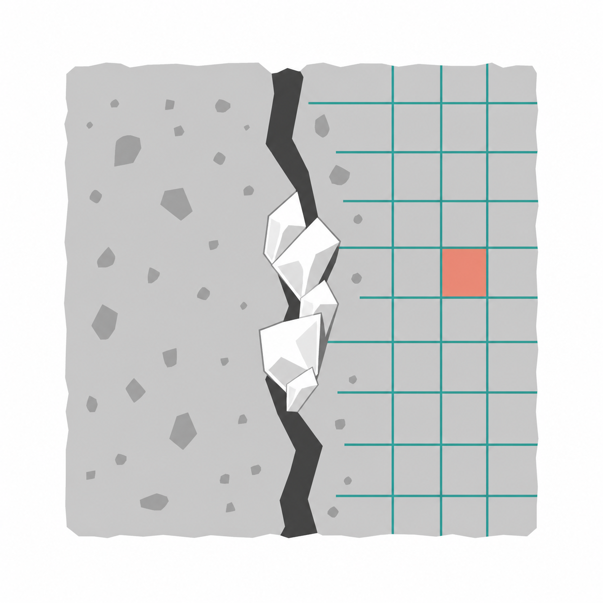
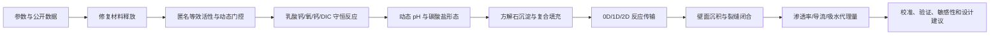
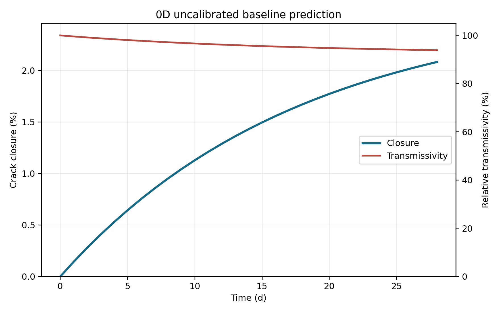
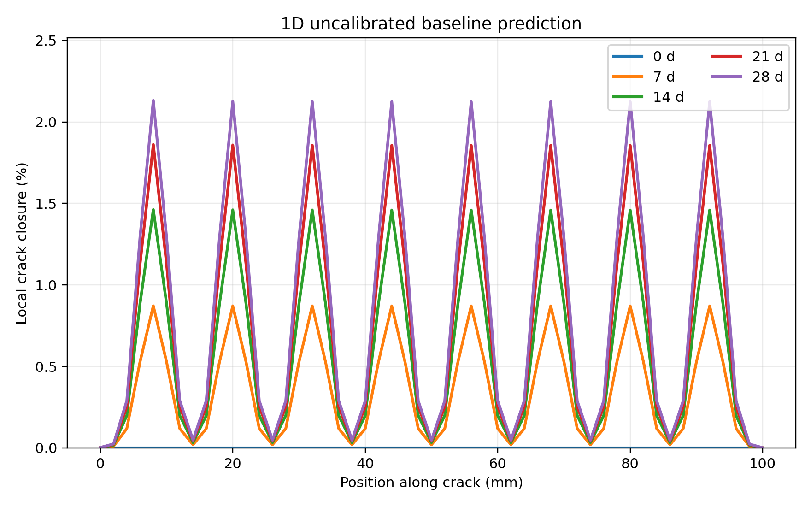
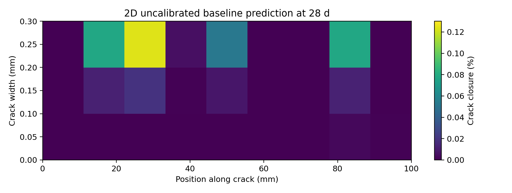

<div align="center">
  
  <h1>BioConcrete Multiscale Model</h1>
  <p><strong>自修复混凝土多尺度反应传输、公开数据校准与不确定性分析工程</strong></p>
  <p>
    <a href="https://github.com/Zwhua/bioconcrete-multiscale-model/releases/tag/v0.2.0"></a>
    <a href="https://www.python.org/"></a>
    <a href="LICENSE"></a>
  </p>
</div>

本项目建立一个从修复材料释放、环境响应、碳酸盐化学和矿物沉积，一直连接到裂缝闭合与材料性能恢复的数学模型。工程提供可复现的 `0D`、`1D` 和真实 `2D` 求解器，以及公开数据处理、参数校准、独立验证、敏感性分析和预注册设计工具。

项目的核心问题是：

> 当含有修复材料的混凝土产生裂缝并接触水和氧后，材料在 0-28 天内如何释放、反应、传输和沉积？这些过程最终能在多大程度上降低裂缝宽度、孔隙率、渗透率和导流能力？

## 证据声明

团队目前没有自己的湿实验时间序列。因此，本仓库严格区分：

| 证据类别 | 定义 | 当前状态 |
| --- | --- | --- |
| `project experiment` | 团队自己的实验数据 | 空，0 条 |
| `public calibration data` | 用于估计参数的公开实验 | 流程已实现，原始文件待导入 |
| `external validation data` | 完全不参与拟合的公开实验 | 冻结验证流程已实现 |
| `measurement error data` | 裂缝宽度测量误差数据 | 独立接口已实现 |
| `literature prior` | 只限定参数范围的文献或数据库先验 | 已整理为参数注册表 |
| `model prediction` | 尚未被项目实验验证的计算结果 | 已生成基线与预注册方案 |

公开数据不会被称为团队实验，合成数据只测试算法，不作为科学证据。本文列出的 28 天结果是**未校准模型基线**，不是实测修复效果，也不是工程性能承诺。

## 建模目的

### 1. 解释系统

将释放、环境响应、底物与氧限制、动态 pH、方解石沉淀、扩散和裂缝几何放入同一守恒框架，解释各过程如何相互限制。

### 2. 预测修复性能

输出 7、14、21、28 天的：

- 乳酸钙库存、乳酸、氧、钙和无机碳浓度；
- 环境信号、激活状态、响应延迟和累计等效活性；
- 方解石沉积量及复合固体填充量；
- 壁面沉积厚度、裂缝闭合率和剩余宽度；
- 相对孔隙率、渗透率、导流能力和吸水代理量；
- 1D/2D 空间分布及质量守恒诊断。

### 3. 支持实验设计

比较裂缝宽度、修复材料剂量、湿润时长、等效活性、响应延迟和基础泄漏的影响，为后续实验给出可检验的优先方案。

### 4. 建立可信证据链

使用公开实验完成“校准 - 按试件内部测试 - 冻结参数 - 独立外部验证”，避免把文献先验或模拟数据包装成项目实验。

## 总体思路



模型不直接预测某个具体实现的微观性能。生物侧被限制为匿名的群体级等效活性接口，只向材料模型提供速率、延迟和泄漏等聚合参数。

## 模型结构

### 1. 统一参数层

所有关键参数均保存：

```text
value, unit, source_class, source_note, lower_bound, upper_bound
```

参数来源优先级为项目实测、目标体系公开数据、相关材料体系、数据库聚合先验和情景假设。使用 `audit-units` 可导出参数、单位和来源审计表。

### 2. 0D 生化与材料反应

每个计算单元追踪 20 个状态，分为六组：

| 类型 | 主要状态 |
| --- | --- |
| 修复材料 | 胶囊内乳酸钙、复合 C-S-H 释放量 |
| 等效活性 | 未激活单元、活性单元、环境信号、激活状态和记忆 |
| 溶解组分 | 乳酸、氧、Ca2+、总无机碳和水合碳 |
| 水泥环境 | Portlandite、总碱度和动态 pH |
| 固体与守恒 | 方解石、等效生物量碳、累计活性 |
| 安全诊断 | 铵态氮诊断量，主模型中必须恒为零 |

修复材料释放采用受水活度控制的一阶模型：

```math
r_{release}=k_{release}f_{aw}C_{cap}
```

匿名等效催化速率为：

```math
v_{eff}=k_{cat,eff}[E]_{eff}\frac{L}{K_{m,eff}+L}
\frac{O_2}{K_O+O_2}f_{pH}f_Tf_{gate}
```

`f_gate` 不是静态开关。模型显式追踪水活度、氧和 pH 的当前值及变化率、信号持续时间、响应延迟、基础泄漏和激活记忆。

总体好氧计量以乳酸钙反应为基础，并扣除进入等效生物量的碳：

```text
Ca(C3H5O3)2 + 6 O2 -> CaCO3 + 5 CO2 + 5 H2O
```

主路线不使用尿素水解，因此不会预测当前体系产生氨。

### 3. 动态 pH 与地球化学

动态模式以总无机碳和总碱度求解碳酸体系电荷平衡：

```math
Alk_T=[HCO_3^-]+2[CO_3^{2-}]+[OH^-]-[H^+]
```

Portlandite 溶解增加钙和碱度，方解石沉淀消耗钙、无机碳和碱度。每个已接受的反应步都必须在配置的 pH 区间内完成电荷平衡；求解失败会终止并报告，不会静默退回固定 pH。

方解石饱和度和沉淀速率为：

```math
\Omega_{cal}=\frac{a_{Ca^{2+}}a_{CO_3^{2-}}}{K_{sp}}
```

```math
r_{cal}=k_{cal}A_s\max(\Omega_{cal}-1,0)^n
```

当前可执行环境没有实际 PHREEQC 后端，因此地球化学表严格标记为 `analytical_surrogate`。在完成真实 PHREEQC 网格和交叉比较前，本项目不声称已经实现 PHREEQC 耦合。

### 4. 1D 与真实 2D 反应传输

空间模型使用有限体积法与算子分裂：

```math
\frac{\partial(\phi C_i)}{\partial t}
=\nabla\cdot(\phi D_{i,eff}\nabla C_i)-\nabla\cdot(qC_i)+Q_i
```

- `1d`：沿裂缝口至裂缝尖端求解，入口连接外界氧和无机碳，尖端无通量。
- `2d`：直接在裂缝长度和宽度方向求解，不使用一维结果插值生成热图。
- 局部刚性反应：`scipy.integrate.solve_ivp(method="BDF")`。
- 扩散与对流：隐式稀疏有限体积矩阵。
- 有效扩散系数：随湿润状态、孔隙率和局部闭合程度变化。
- 修复材料：在空间模型中使用可复现的离散源密度场。

### 5. 从矿物体积到裂缝修复

模型首先将方解石摩尔数和 C-S-H 载荷换算为固体体积：

```math
V_s=\frac{n_{cal}M_{cal}}{\rho_{cal}}+V_{csh}
```

然后使用 `wall_deposition_fraction` 区分裂缝壁沉积与其他位置填充：

```math
\delta_{one\ wall}=\frac{V_{wall}}{A_{wall,total}}
```

```math
H_{closure}=clip\left(\frac{2\delta}{b_0},0,1\right)
```

因此模型明确区分：

```text
solid_fill_fraction
wall_deposition_thickness_mm
crack_closure_ratio
```

旧字段 `healing_ratio` 只作为兼容别名，不再作为报告中的科学定义。

裂缝导流能力采用立方律：

```math
\frac{T}{T_0}=\left(\frac{b}{b_0}\right)^3
```

多孔基体渗透率采用相对 Kozeny-Carman 关系。总矿物质量使用裂缝长度、宽度、深度或未解析厚度计算，不再把浓度误当作总质量。

## 最新基线结果

默认条件：

| 配置 | 数值 |
| --- | ---: |
| 模拟时间 | 28 d |
| 裂缝长度 | 100 mm |
| 初始裂缝宽度 | 0.30 mm |
| 裂缝深度 | 20 mm |
| 温度 | 30 C |
| 湿润制度 | 12 h/d |
| pH 模式 | 动态电荷平衡 |
| 碳酸盐模式 | 快速平衡 |

最新 `0D` 未校准基线输出：

| 指标 | 28 天结果 |
| --- | ---: |
| 平均裂缝闭合率 | **2.0819%** |
| 相对渗透率 | **0.9079** |
| 相对裂缝导流能力 | **0.9388** |
| 方解石浓度 | **0.6049 mol/m3** |
| 方解石质量浓度 | **0.06054 kg/m3** |
| 按默认裂缝体积计算的方解石总质量 | **0.03632 mg** |
| 铵态氮诊断量 | **0 mol/m3** |

这个结果说明：当前先验参数不会自动得到 80% 的目标闭合率。模型给出了一个保守、可追溯的起点，也表明释放速率、有效活性、壁面沉积分数和湿润/供氧条件需要公开实验或项目实验校准。

`80%` 仅是评价目标线，从未被写入方程或强制拟合。

### 结果图表

以下图表来自 `v0.2.0` 方程与当时的默认先验，属于**历史未校准基线预测**，不能解释为实验结果。后续版本已统一跨尺度总剂量，因此 1D/2D 数值不应用于当前跨尺度定量比较；新图将在冻结公开数据校准流程后重建。

#### 0D：闭合率与裂缝导流能力随时间变化



均匀体系中，预测闭合率在 28 天内逐渐增加至 `2.0819%`，对应相对裂缝导流能力下降至 `0.9388`。曲线没有被约束到 80% 目标线。

#### 1D：裂缝轴向闭合分布



闭合峰与八个离散修复材料源的位置一致，并随 7、14、21、28 天逐渐增长。28 天空间平均闭合率为 `0.8366%`，局部最大值为 `2.1325%`。这说明空间平均修复效果可能显著低于局部观察到的最佳位置。

#### 2D：28 天局部闭合热图



二维图直接求解长度和宽度方向，展示局部修复源、传输和边界条件共同形成的非均匀闭合。为了在 README 构建时间内复现完整 28 天结果，本图采用 `9 x 3` 网格和 24 小时反应步；它仍是真实二维求解，不是一维插值。该展示情景的平均闭合率为 `0.0146%`，局部最大值为 `0.1239%`。默认 `15 x 5` 网格仍用于模型配置和网格收敛验收。

| 层级 | 运行配置 | 28 天平均闭合率 | 局部最大闭合率 | 相对渗透率 | 相对裂缝导流能力 |
| --- | --- | ---: | ---: | ---: | ---: |
| 0D | 均匀体系 | 2.0819% | 2.0819% | 0.9079 | 0.9388 |
| 1D | 51 个轴向节点 | 0.8366% | 2.1325% | 0.9626 | 0.9753 |
| 2D 展示 | `9 x 3` 网格 | 0.0146% | 0.1239% | 0.9993 | 0.9996 |

不同层级的平均结果不能被简单视为同一试件的三个重复预测。空间模型包含离散源、扩散限制和不同的有效计算体积，主要用于解释空间异质性与局部封堵位置。

## 数值验证结果

当前共 **33 项自动测试全部通过**。最新快速验收结果：

| 检查 | 结果 | 验收阈值 |
| --- | ---: | ---: |
| 封闭体系碳守恒误差 | `4.55e-16` | `< 0.5%` |
| 封闭体系钙守恒误差 | `4.20e-16` | `< 0.5%` |
| 时间步减半差异 | `2.23e-7` | `< 5%` |
| 1D 网格加密差异 | `6.71e-12` | `< 5%` |
| 2D 网格加密差异 | `1.17e-10` | `< 5%` |
| 无修复源矿化量 | `0` | `< 1e-10 mol/m3` |
| 无氧矿化 | `0` | 必须为 `0` |
| 沉淀关闭且无复合填充时闭合率 | `0` | 必须为 `0` |
| 所有状态非负 | 通过 | 必须通过 |
| 铵态氮诊断量 | `0` | 必须为 `0` |

测试还覆盖动态/固定 pH 极限、响应延迟、基础泄漏、厚度质量缩放、按试件分组和冻结配置篡改检测。

数值收敛证明代码在当前测试下稳定，但不等于实验有效性。

## 公开数据证据链

### 数据集 A：公开校准

[Tran-SET 封装细菌自修复混凝土数据](https://zenodo.org/records/3471960)用于拟合跨体系共享的释放、等效活性、沉淀和材料响应参数。训练与内部测试按 `specimen_id` 分组，禁止同一试件的不同时间点跨集合泄漏。

### 数据集 B：独立外部验证

[Zenodo 11305154](https://zenodo.org/records/11305154)只在参数冻结后读取结果字段。外部验证代码不包含优化器，并报告 MAE、RMSE、R2、AIC、预测区间覆盖率，以及零矿化和一阶经验基线。

### 数据集 C：测量误差

[krkCMd](https://zenodo.org/records/14568863)只用于裂缝宽度测量误差，不参与反应动力学拟合。

数据工具会记录 DOI、URL、许可、下载时间、文件大小和 SHA-256。规范化记录保留原始文件、工作表与行号。原始数据及本地派生表默认不进入 Git。

当前网络环境访问 Zenodo 自动下载接口时返回 HTTP 403，因此仓库没有伪造校准结果。手动下载位置见 [data/public/MANUAL_DOWNLOADS.md](data/public/MANUAL_DOWNLOADS.md)。

## 校准、验证与不确定性

### 分阶段校准

1. 早期时间点拟合释放与等效活性；
2. 只有存在矿物质量观测时才开放沉淀参数；
3. 裂缝宽度拟合壁面沉积与几何映射；
4. 渗透率或刚度恢复约束材料响应；
5. 按试件留出的内部测试检查过拟合；
6. 保存配置 SHA-256 并冻结共享参数；
7. 在数据集 B 上进行不重新拟合的外部验证。

工具输出 bootstrap 置信区间、参数相关矩阵、可选 profile likelihood，以及 7、14、21、28 天预测区间。没有足够观测约束的参数固定为文献先验并列入 `fixed_to_prior`。

### 正式敏感性分析

`formal-sensitivity` 使用 SALib：

- Morris 独立轨迹筛选参数；
- Saltelli/Sobol 采样计算 `S1` 和 `ST`；
- bootstrap 95% 置信区间；
- 256、512、1024 基础样本收敛比较；
- 明显越界的指标标记为未收敛，不进行裁剪。

旧 `sensitivity` 命令只用于历史复现，不属于正式敏感性证据。

## 预注册设计矩阵

[PREREGISTERED_SCENARIOS.yml](PREREGISTERED_SCENARIOS.yml)在查看外部验证结果前固定以下情景：

- 裂缝宽度：0.1、0.3、0.5 mm；
- 修复材料剂量：低、中、高三档；
- 湿润时间：6、12、24 h/d；
- 等效活性：0.5、1、2、5 倍；
- 响应延迟：0、4、12、24 h；
- 基础泄漏：0%、1%、5%、10%。

共 `3 x 3 x 3 x 4 x 4 x 4 = 1,728` 个组合。评价指标包括 28 天闭合率、达到 50% 闭合的时间、相对渗透率、单位剂量收益、提前消耗和目标达成概率。Pareto 输出分为：

```text
recommended
robust_alternative
not_recommended
```

这些分类是“公开数据支持的待验证预测”，不是已经完成的实验结论。

## 安装与复现

需要 Python 3.8 或更高版本：

```powershell
git clone https://github.com/Zwhua/bioconcrete-multiscale-model.git
cd bioconcrete-multiscale-model
python -m pip install -r requirements-lock.txt
python -m pip install -e . --no-build-isolation
```

生成最新默认配置，不建议继续使用旧版本配置文件：

```powershell
python -m bioconcrete default-config --output config-v0.2.0.json
```

运行模型与验证：

```powershell
python -m bioconcrete simulate --level 0d --config config-v0.2.0.json
python -m bioconcrete simulate --level 1d --config config-v0.2.0.json
python -m bioconcrete simulate --level 2d --config config-v0.2.0.json
python -m bioconcrete validate --config config-v0.2.0.json
python -m unittest discover -s tests -v
```

运行数据与证据链：

```powershell
python -m bioconcrete prepare-data
python -m bioconcrete audit-units
python -m bioconcrete fetch-public-data --manifest data/public/DATASETS.yml
python -m bioconcrete prepare-public-data --dataset transet_18clsu02
python -m bioconcrete prepare-public-data --dataset marine_external

python -m bioconcrete calibrate-public `
  --train data/public/derived/transet_18clsu02/observations.csv `
  --bootstrap 100 --profile-points 9

python -m bioconcrete validate-external `
  --dataset data/public/derived/marine_external/observations.csv `
  --frozen-run model_runs/public_calibration

python -m bioconcrete formal-sensitivity --samples 1024
python -m bioconcrete design-matrix --preregister PREREGISTERED_SCENARIOS.yml
python -m bioconcrete evidence-report --run model_runs/public_calibration
```

每次模拟保存：

```text
state.csv
summary.json
diagnostics.json
config.json
REPORT.md
timecourse.png / healing_profiles.png / healing_map.png
```

## 工程目录

```text
bioconcrete/
  model.py              0D/1D/2D 反应传输求解器
  chemistry.py          碳酸盐、电荷平衡与地球化学后端审计
  config.py             参数、单位范围与配置校验
  public_data.py        公开数据下载、校验和与规范化
  evidence.py           分阶段校准、冻结验证与测量误差
  formal_analysis.py    SALib Morris/Sobol 正式敏感性
  design.py             预注册情景与 Pareto 分类
  validation.py         守恒、限制情景与离散收敛检查
  report.py             图表与运行报告
  cli.py                命令行入口
data/public/            数据清单、许可边界和下载教程
examples/               统一观测表结构示例
tests/                  模型与证据链自动测试
MODELING.md             紧凑技术说明
WIKI_MODEL.md           iGEM Wiki 风格模型页面
```

## 当前结论

1. 已完成从反应、动态环境、碳酸盐化学到裂缝闭合的多尺度计算框架。
2. 动态 pH、几何量纲、总质量和壁面沉积映射已经显式化。
3. 0D、1D 和真实 2D 求解均通过当前快速守恒与收敛测试。
4. 默认未校准参数只产生约 2.08% 的 28 天闭合，说明目标结果没有被硬编码。
5. 公开数据校准、冻结外部验证和正式不确定性工具已经实现，但尚缺本地导入的公开原始实验文件。
6. 当前最重要的下一步是完成数据集 A/B 的字段核验、正式校准和独立验证，而不是继续增加模型复杂度。

## 限制与下一步

- 当前没有团队自己的湿实验数据，模型不能用于工程安全决策。
- 公开数据下载受当前 Zenodo 网络策略限制，需要手动导入并逐行核验字段。
- 地球化学后端目前是解析代理，尚未完成真实 PHREEQC 交叉验证。
- 1D/2D 采用简化裂缝几何，没有解析完整三维粗糙表面和结构力学。
- 正式 1024 样本 Sobol 和 1,728 组设计矩阵计算成本较高，应在冻结校准参数后批处理。
- 获得公开数据后，应先发布校准、内部测试和外部验证报告，再将设计建议用于前瞻性实验。

## 版本、许可与引用

- 当前版本：`v0.2.0`
- 许可证：[MIT](LICENSE)
- 引用信息：[CITATION.cff](CITATION.cff)
- 技术说明：[MODELING.md](MODELING.md)
- Wiki 页面：[WIKI_MODEL.md](WIKI_MODEL.md)

项目仓库：<https://github.com/Zwhua/bioconcrete-multiscale-model>
