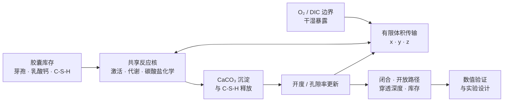

<div align="center">
  
  <h1>BioConcrete Multiscale Model</h1>
  <p><strong>面向微生物辅助裂缝修复的守恒型多尺度反应传输模拟器</strong></p>
  <p>
    <a href="https://github.com/Zwhua/bioconcrete-multiscale-model/releases/tag/v0.5.1"></a>
    
    <a href="https://github.com/Zwhua/bioconcrete-multiscale-model/actions/workflows/tests.yml"></a>
    <a href="https://www.python.org/downloads/"></a>
    <a href="LICENSE"></a>
  </p>
  <p><a href="README.md">English</a> · 简体中文</p>
  <p>
    <a href="#工程目标"><strong>目标</strong></a> ·
    <a href="#解决方法"><strong>方法</strong></a> ·
    <a href="#数据与证据"><strong>数据</strong></a> ·
    <a href="#数值实验与结果"><strong>结果</strong></a> ·
    <a href="#复现结果"><strong>复现</strong></a>
  </p>
</div>

> [!IMPORTANT]
> **证据边界：**本仓库是一个**尚未校准的机理模型**。团队湿实验时间序列数据为 **0 行**。下文“实验”特指数值验证或计算实验，不是实验室观测、结构强度预测或现场验证。

<table align="center">
  <tr>
    <td align="center"><strong>Gate D 已通过</strong><br><sub>守恒 · 降维 · 收敛</sub></td>
    <td align="center"><strong>&lt; 1.9 × 10<sup>−16</sup></strong><br><sub>封闭体系碳/钙平衡误差</sub></td>
    <td align="center"><strong>0.606%</strong><br><sub>最大 medium–fine 差异</sub></td>
    <td align="center"><strong>128 项通过</strong><br><sub>本地 Python 3.8 测试</sub></td>
  </tr>
</table>

## 工程目标

自修复混凝土跨越多个相互耦合的尺度：修复剂释放和微生物代谢改变水相化学；传输重新分配氧、乳酸盐、无机碳和钙；CaCO₃ 沉淀与 C-S-H 填充降低局部开度；变化后的几何又反过来影响后续传输。

本工程的目标是使这条链路具备**质量守恒、显式空间分辨、可恢复计算和可证伪性**，并回答：

- 裂缝内部何处因氧或底物限制而抑制修复；
- 表面闭合是否掩盖了内部仍连通的开放路径；
- CaCO₃ 与预设 C-S-H 载荷分别贡献了多少闭合；
- 哪些测量与对照最能降低工程决策不确定性。

它是反应传输与开度演化模型，不是完整的混凝土力学或强度恢复模型。

## 解决方法



实现采用共享 0D 反应核和隐式单元中心有限体积传输。3D 求解器固定使用 **Strang 分裂**：半步传输、完整反应、半步传输；时间步严格切分在输出、干湿切换和 checkpoint 时刻。固体沉积会在下一次传输前更新开度、流体体积分数、孔隙率和封闭柱。

核心工程能力包括：

- 0D、1D、旧 `(x,y)` 2D、`(x,z)` 2.5D 适配器和完整 `(x,y,z)` 3D 路径；
- Robin 边界供氧与旧体积供氧严格互斥；
- 体积加权碳/钙账本、逐物种逐边界面通量及反应积分；
- 有限次数时间步减半重试与机器可读 failure manifest；
- checkpoint 携带状态、账本、计数器、配置哈希和几何哈希；
- 正式 Xarray/Zarr 全场数据，统一 `(time,z,y,x)` 轴序和证据元数据；
- 无图形界面的 Matplotlib PNG/SVG，以及可选 PyVista 等值面和交互 HTML。

既有方程见 [MODELING.md](MODELING.md)，冻结的 3D 开发规范见 [THREED_MODEL_SPEC.md](THREED_MODEL_SPEC.md)。

## 数据与证据

仓库严格区分**输入先验、公开数据清单、合成数值验证情景和实验观测**。

| 数据层 | 仓库位置 | 内容 | 证据用途 |
| --- | --- | --- | --- |
| 公开数据注册表 | [`data/public/DATASETS.yml`](data/public/DATASETS.yml) | 4 个用于校准、外部评估和测量误差的登记记录；不再分发原始文件 | 数据获取计划，不声明已校准 |
| 总体动力学先验 | [`data/processed/model_priors/`](data/processed/model_priors/) | 38 行 SABIO-RK 摘要、10 行 BRENDA 摘要、10 个注册参数 | 只用于构造先验 |
| 碳酸盐查找表 | [`data/processed/geochem/`](data/processed/geochem/) | 解析近似的碳酸盐状态与元数据 | 快速化学查询，不等于 PHREEQC 验证 |
| 生物设计映射 | [`data/biological_design/`](data/biological_design/) | 匿名设计类别到可测总体参数的映射 | 前瞻性设计接口 |
| Gate D 情景 | 由 `validate-3d --full` 生成 | 1 天、持续湿润、封闭边界、显式 O₂/DIC、固定种子和相同胶囊总库存 | 仅用于数值验证 |
| 团队湿实验序列 | 不可用 | **0 行** | 不作实验性能声明 |

蛋白序列、突变位点、遗传构建设计和菌株特异记录不属于此模型接口。公开数据许可和下载说明见 [data/public/README.md](data/public/README.md)。

## 数值实验与结果

### 1. Gate D 数值验证

冻结的非零反应情景通过了全部 Gate D 要求：守恒、降维、有限且非负、checkpoint 等价性，以及网格与时间收敛。

<p align="center">
  
</p>
<p align="center"><sub><em>图由完整机器可读验证报告生成；虚线为预注册验收阈值。未校准模型输出，不是实验数据。</em></sub></p>

| 检查项 | 结果 | 验收阈值 | 状态 |
| --- | ---: | ---: | :---: |
| 封闭体系碳平衡 | **1.882 × 10⁻¹⁶** 相对误差 | &lt; 0.5% | 通过 |
| 封闭体系钙平衡 | **1.738 × 10⁻¹⁶** 相对误差 | &lt; 0.5% | 通过 |
| 单体素 3D → 共享 0D | **0** 相对误差 | &lt; 1% | 通过 |
| `y,z` 均匀 3D → 1D 传输 | **8.882 × 10⁻¹⁶** 绝对误差 | ≤ 10⁻⁶ | 通过 |
| `z` 均匀 3D → 旧 `(x,y)` 2D | **1.243 × 10⁻¹⁴** 绝对误差 | ≤ 10⁻⁶ | 通过 |
| `y` 均匀 3D → `(x,z)` 2.5D | **1.421 × 10⁻¹⁴** 绝对误差 | ≤ 10⁻⁶ | 通过 |
| 最大 medium–fine 网格差异 | **0.606%**（O₂ 穿透深度） | &lt; 5% | 通过 |
| 最大 3 h–1.5 h 时间步差异 | **0.00283%**（方解石总量） | &lt; 5% | 通过 |

网格验证在三个方向同步加密：**21×3×9 → 41×5×17 → 81×7×33**。medium–fine 差异分别为：方解石总量 0.153%、面积加权闭合 0.00146%、最大局部闭合 0.0400%、开放体积 3.27×10⁻⁷%、氧穿透深度 0.606%。时间验证采用 6 h、3 h 和 1.5 h。以上结果证明注册情景下的数值一致性，不证明参数准确性。

### 2. 空间场与几何反馈

<table>
  <tr>
    <td width="50%"></td>
    <td width="50%"></td>
  </tr>
  <tr>
    <td><sub><strong>氧的三向切片。</strong> 规范 3D 状态按 <code>(time,z,y,x)</code> 保存，渲染器生成一致的 <code>xy/xz/yz</code> 切片。</sub></td>
    <td><sub><strong>几何反馈。</strong> 局部固体沉积改变开度与闭合，再反馈到后续传输。开度方向仅为可视化放大 100 倍。</sub></td>
  </tr>
</table>

两幅图来自小型 **9×3×5 存储与渲染烟雾运行**。0.01 天短时长只用于检查产物链路，不用于估计修复性能。所有正式图均显示运行版本、配置/几何来源、网格，以及 “Uncalibrated 3D model output” 和 “Not experimental data”。

### 3. 既有 28 天基线决策结果

v0.5.1 默认 0D 基线保持不变：

| 输出 | 模型结果 | 解释 |
| --- | ---: | --- |
| 28 天裂缝闭合 | **2.0819%** | 未校准基线，不是性能声明 |
| C-S-H 贡献 | **2.08023 个百分点** | 在预设载荷下占模拟闭合的 **99.92%** |
| 方解石贡献 | **0.00168 个百分点** | 在当前先验下较小 |
| 相对渗透率 | **0.9388** | 三次方律模型输出 |

这一负结果具有决策价值：在当前先验下，仅提高总体生物活性不太可能实质改变闭合，除非同时改变库存、传输、沉积或几何约束。下一步仍建议比较完整体系、无 C-S-H 条件和非生物 C-S-H 对照。

## 开发门控

| Gate | 范围 | 状态 |
| --- | --- | :---: |
| A | 冻结 3D 科学规范 | ✅ 完成 |
| B | 共享状态/反应模式与 v0.5.1 回归 | ✅ 完成 |
| C | 守恒 3D 传输、真实 z 梯度、通量闭合、扩散 MMS | ✅ 完成 |
| D | 耦合守恒、降维、恢复、网格/时间收敛 | ✅ 通过 |
| E | 完整 2.5D 反应传输适用性研究 | ⏳ 未完成 |
| F | 干净发布候选 CI、manifest、版本升级、tag/release | ⏳ 未完成 |

因此，可安装包版本仍为 **0.5.1**，3D 产物标记为 **v0.6.0-development**。Gate D 通过允许正式 3D 存储与渲染，但不表示 v0.6.0 已达到发布条件。

## 复现结果

### 稳定核心与快速检查

```bash
git clone https://github.com/Zwhua/bioconcrete-multiscale-model.git
cd bioconcrete-multiscale-model
python -m pip install -r requirements-lock.txt
python -m pip install -e . --no-build-isolation

python -m bioconcrete default-config --output config-v0.5.1.json
python -m bioconcrete validate --config config-v0.5.1.json
python -m bioconcrete validate-3d --output model_runs/v0.6.0/validation_3d
```

### 完整 Gate D、Zarr 与正式图

```bash
python -m pip install -e ".[three-d,visualization-3d]" --no-build-isolation
python -m bioconcrete validate-3d --config config-v0.5.1.json --output model_runs/v0.6.0/validation_3d --full
python -m bioconcrete simulate --level 3d --config config-v0.5.1.json --output model_runs/v0.6.0/3d/demo
python -m bioconcrete render-3d --run model_runs/v0.6.0/3d/demo
```

完整 3D 验证比烟雾检查耗时更长。缺少 Xarray/Zarr/Numcodecs 时，正式存储会给出明确安装错误，不会用 NPZ 或 CSV 冒充正式全场数据。PyVista 是可选依赖，只影响等值面和交互产物。

正式运行目录：

```text
model_runs/v0.6.0/3d/<run_id>/
├── fields.zarr/              # 完整场；(time,z,y,x)
├── summary.json              # 标量工程指标
├── diagnostics.json          # 守恒与求解诊断
├── config.json               # 完整解析配置
├── geometry.json             # 几何尺寸与哈希
├── boundary_conditions.json
├── run_manifest.json         # Git/配置/几何来源
├── performance.json
├── checkpoints/
└── figures/                  # 带证据标签的 PNG/SVG/HTML
```

## 质量、范围与局限

- 本地 Python 3.8 参考运行完成 **128 项测试**；由于该解释器未安装可选依赖，1 项 Zarr 集成测试跳过。安装 extras 后，Zarr 往返集成测试已在 Python 3.12 单独通过。
- 历史 v0.5.1 的 0D/1D/2D 回归 fixture 已冻结；3D 实现通过新增路径扩展功能，不会静默替换旧离散。
- 公开数据校准、独立样本级外部评估、团队湿实验时间序列和 PHREEQC 交叉检查仍未完成。
- 当前几何可接收显式 3D 开度场，但不解析断裂力学、钢筋、载荷重分配、强度恢复或现场安全。
- 28 天 3D 运行仅可在 Gate D 通过后用于代表性可视化，不得表述为实验验证。

详细证据审计见 [SCIENTIFIC_AUDIT_V0.6.0.md](SCIENTIFIC_AUDIT_V0.6.0.md)，数据需求见 [THREED_DATA_REQUIREMENTS.md](THREED_DATA_REQUIREMENTS.md)，发布边界见 [RELEASE_CHECKLIST_V0.6.0.md](RELEASE_CHECKLIST_V0.6.0.md)。

## 引用与许可

当前稳定版本为 [v0.5.1](https://github.com/Zwhua/bioconcrete-multiscale-model/releases/tag/v0.5.1)。请按 [CITATION.cff](CITATION.cff) 引用软件；本仓库不声明论文或 DOI。项目采用 [MIT License](LICENSE)。
