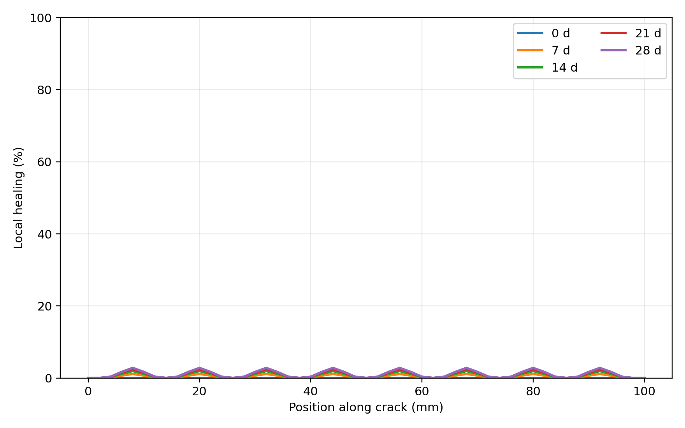

# BioConcrete model report

- Model level: `1d`
- Final mean healing: 1.117%
- Final maximum healing: 2.842%
- Mean permeability ratio: 0.9626
- Mean crack transmissivity ratio: 0.9672
- Mean calcite: 0.117 kg/m3 crack volume
- Maximum ammonium: 0.000e+00 mol/m3
- Nonnegative states: `True`
- Ammonia-free invariant: `True`

The 80% healing value is an evaluation target, not a fitted or hard-coded outcome.
Database-derived values are priors. Project-specific rates require calibration against repair experiments.
